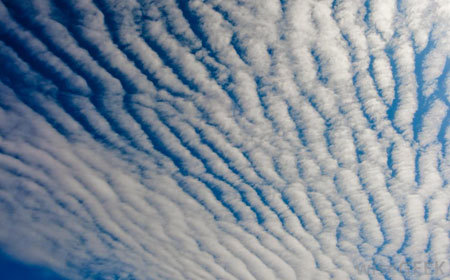

Cloud Terminology
=================

A Meteorological Adventure

Definition
----------

"In meteorology,a cloud is an aerosol comprising a visible mass of
minute liquid droplets or frozen crystals, both of which are made of
water or various chemicals." ~ `Wikipedia`_

Genera
======

Latin Roots
-----------

* **Alto** means medium-level
* **Cirro** means wisp of hair
* **Cumulo** means heap
* **Nimbo** means rain
* **Strato** means layered

Cirrus (Ci)
-----------

Delicate, white, patchy, silky, made of ice

.. figure:: static/cirrus.jpg
    :align: center
    :height: 400px

Cirrocumulus (Cc)
-----------------

Thin, white, patch ribbon or sheet

Cirrostratus (Cs)
-----------------

Transparent, white, smooth, sheet

.. figure:: static/

Altostratus (As)
----------------

Grey or blue sheet, fibrous, uniform

Altocumulus (Ac)
----------------

White or grey sheet, rounded and rolling

Nimbostratus (Ns)
-----------------

Thick, dark grey layer

Stratocumulus (Sc)
------------------

.. note::

    Grey or whitish, or both grey and whitish, patch, sheet or layer of cloud
    which almost always has dark parts, composed of tessellations, rounded
    masses, rolls, etc., which are non-fibrous (except for virga) and which
    may or may not be merged; most of the regularly arranged small elements
    have an apparent width of more than five degrees.

Stratus (St)
------------

.. note::

    Generally grey cloud layer with a fairly uniform base, which may give
    drizzle, ice prisms or snow grains. When the sun is visible through the
    cloud, its outline is clearly discernible. Stratus does not produce halo
    phenomena except, possible, at very low temperatures.

Cumulus (Cu)
------------

.. note::

    Detached clouds, generally dense and with sharp outlines, developing
    vertically in the form of rising mounds, domes or towers, of which the
    bulging upper parts often resembles a cauliflower. The sunlit parts of
    these clouds are mostly brilliant white; their base is relatively dark
    and nearly horizontal. 

Cumulonimbus (Cb)
-----------------

.. note::

    Heavy and dense cloud, with a considerable vertical extent, in the form
    of a mountain or huge towers. At least part of its upper portion is
    usually smooth, or fibrous or striated, and nearly always flattened; this
    part often spreads out in the shape of an anvil or vast plume. Under the
    base of this cloud which is often very dark, there are frequently low
    ragged clouds ether merged with it or not, and precipitation sometimes in
    the form of virga.

Shooting Clouds
---------------

People have actually tried to do that, on several occasions, with an
attempt to end global warming by shooting crystal salt seeds at
clouds, causing a permanent low hanging cloud cover that will
deflect the sunlight and stop global warming. The experiment proved
to be unsuccessful when the scientists realized that excess cloud
cover might actually warm the planet by trapping heat. In fact, a
2009 Stanford University Study shows that aircrafts, which create
clouds are accountable for 4 to 8 percent of the warming that has
occurred since record keeping began in 1850.

The International Cloud Committee
---------------------------------

Sources
-------

* `10 Fun Facts You Didn't Know About Clouds`_
* `Glossary of Terms`_
  
.. _Wikipedia: https://en.wikipedia.org/wiki/Cloud
.. _Glossary of Terms: http://www.skystef.be/clasclouds-terms.htm
.. _10 Fun Facts You Didn't Know About Clouds: https://www.cloudyn.com/blog/10-fun-facts-you-didnt-know-about-clouds/
