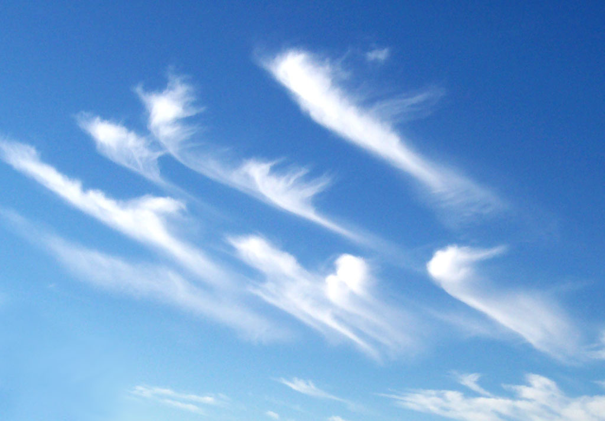
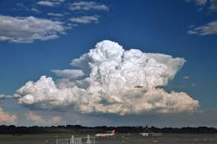

Clouds
======

A Meteorological Adventure
https://slides.lucywyman.me/clouds.html

Definition
----------

"In meteorology a cloud is an aerosol comprising a visible mass of
minute liquid droplets or frozen crystals, both of which are made of
water or various chemicals." ~ `Wikipedia`_

Genera
======

Latin Roots
-----------

* **Alto** means medium-level
* **Cirro** means wisp of hair
* **Cumulo** means heap
* **Nimbo** means rain
* **Strato** means layered

Low-Level Clouds
================

Stratus (St)
------------

Grey blanket

.. figure:: static/stratus.jpg
    :align: center
    :height: 400px

Cumulus (Cu)
------------

Puffy, white, cottony

Stratocumulus (Sc)
------------------

Puffy, patchy, grayish or whitish

.. figure:: static/stratocumulus.jpg
    :align: center
    :height: 400px

Mid-Level Clouds
================

Altocumulus (Ac)
----------------

White or grey patches - like sheep!

Nimbostratus (Ns)
-----------------

Thick, dark grey layer

Altostratus (As)
----------------

Grey or bluish-grey sheets

.. figure:: static/altostratus.jpg
    :align: center
    :height: 400px

High-Level Clouds
=================

Cirrus (Ci)
-----------

Delicate, white, patchy, silky, made of ice

Cirrocumulus (Cc)
-----------------

Thin, white, patch ribbon or sheet

Cirrostratus (Cs)
-----------------

Transparent, white veil

.. figure:: static/cirrostratus.jpg
    :align: center
    :height: 400px

The Snowflake
=============

Cumulonimbus (Cb)
-----------------

Heavy, dense, vertical

Fun Facts
=========

Shooting Clouds
---------------

Weaponized Weather
------------------

.. figure:: static/weather-stop-sign.gif
    :align: center
    :height: 400px

`International Commission on Clouds and Precipitation`_
-------------------------------------------------------

Sources
-------

* `10 Fun Facts You Didn't Know About Clouds`_
* `Glossary of Terms`_
* `Cloud Atlas`_
  
.. _Wikipedia: https://en.wikipedia.org/wiki/Cloud
.. _Glossary of Terms: http://www.skystef.be/clasclouds-terms.htm
.. _10 Fun Facts You Didn't Know About Clouds: https://www.cloudyn.com/blog/10-fun-facts-you-didnt-know-about-clouds/
.. _Cloud Atlas: https://cloudatlas.wmo.int/cirrus-ci.html
.. _International Commission on Clouds and Precipitation: http://www.iccp-iamas.org
