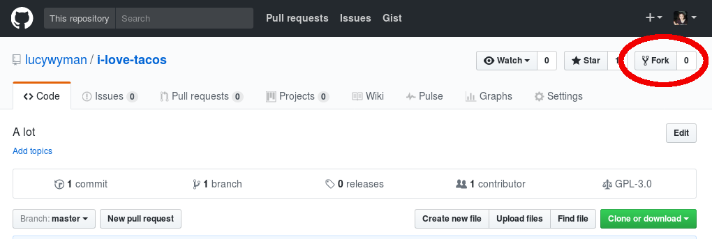
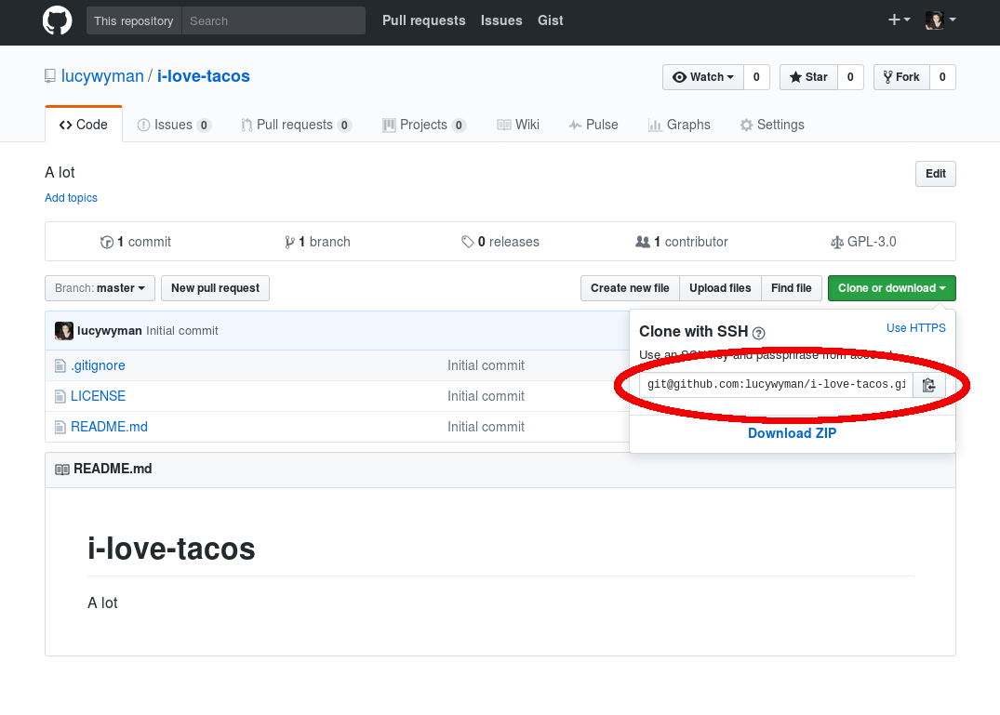
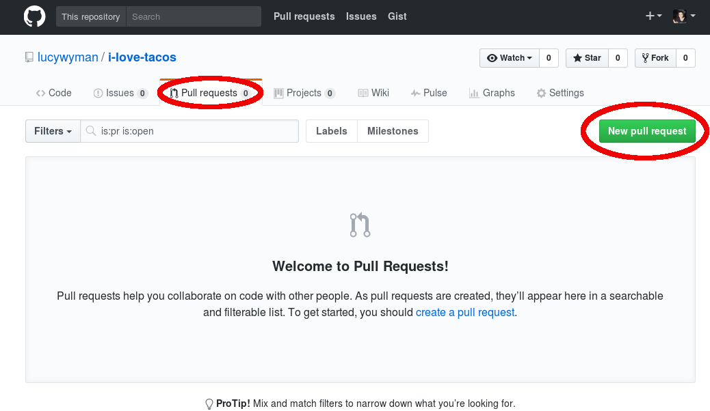

How Can I Contribute?
=====================

A Guide to Making Your First Open Source Contribution

https://slides.lucywyman.me/how-can-i-contribute.html

By The End You'll Know...
-------------------------

* Why you should contribute
* Skillz you can contribute
* How to find a project
* Lightening fast introduction to Git and Github

:code:`$ whoami`
----------------

.. rst-class:: build

  .. figure:: static/cartoon-programming.gif
      :align: center
      :height: 300px

Lucy Wyman

Software Engineer - `Bolt`_

`Puppet`_

.. _Bolt: https://github.com/puppetlabs/bolt
.. _Puppet: https://puppet.com

`Source <https://arghh.github.io/>`_

What is Open Source?
--------------------

.. rst-class:: build

* Code is publicly available
* Can be contributed to by the public
* Actively maintained and open to contribution
* Free software? 

Sounds great, but...
--------------------

.. rst-class:: build

* Contributing to open source doesn’t benefit me at all # I know you don't think this, but some people do!
* I’m not a good enough programmer to contribute to open source
* I don’t know the project well enough to contribute
* I don’t write code, so I have nothing to contribute
* I’m just a student / community member / manager / llama, I don’t have anything to contribute
* Contributing to open source is hard

Why Should You Contribute?
--------------------------

.. rst-class:: build

* Give back to a project you use + love
* Encourage collaboration and innovation
* Improve a skill
* Don't reinvent the wheel
* Make the world a better place!

How Can You Contribute?
=======================

File Bugs
---------

.. figure:: static/bugs-bunny.jpg
    :align: center
    :height: 300px

`Source <http://www.neatorama.com/2010/11/08/a-brief-history-of-bugs-bunny/>`_

.. nextslide::

Github issues | Bug tracker | Contact (email, twitter, etc.)

Include:

.. rst-class:: build

- What version you were using, browser version, OS, etc.
- What you were trying to do
- How you tried to do it (be detailed!)
    - Steps for reproduction
- What you expected to happen
- What actually happened

Write Documentation
-------------------

.. rst-class:: build

* Contribute to official documentation
* Add or update a `README`_
* Write a blog post
* Getting started guide

.. figure:: static/rtfm.png
    :align: right
    :height: 250px

`Source <https://cmenghi.deviantart.com/art/Mao-RTFM-vectorize-72728695>`_

.. _README: https://www.computerhope.com/jargon/r/readme.htm

Answer Questions
----------------

.. rst-class:: build

* In `Github`_ issues
* On `IRC`_ or `Slack`_
* On `StackOverflow`_
* On `Reddit`_

`Source <http://mtv.tumblr.com/post/121053588885>`_

.. _Github: https://github.com
.. _IRC: https://kiwiirc.com/
.. _Slack: https://slack.com/
.. _StackOverflow: https://stackoverflow.com
.. _Reddit: https://www.reddit.com/r/linuxquestions/

Educate
-------

.. figure:: static/the-more-you-know.gif
    :align: center
    :height: 200px

.. rst-class:: build

* Give a talk!
    * This can be at a `user group`_ meeting, `bar camp`_, or other event
* Volunteer for a workshop or event
    * `Resources`_
* Represent an open source project at an event

.. _user group: https://www.meetup.com/find/events/tech/
.. _bar camp: http://beaverbarcamp.org/
.. _Resources: 

Design
------

.. figure:: static/docker_logo.png
    :align: center
    :height: 300px

.. rst-class:: build

* A logo
* A `helpful diagram`_
* A new feature

`Source <https://www.redbubble.com/people/talisso/works/26870087-docker-logo?p=sticker>`_
  
.. _helpful diagram: https://deis.com/images/blog-images/kubernetes-overview-1-0.png 

Finding a Project
-----------------

In order of perceived helpfulness:

* `Explore Github`_
* `What Can I Do For Mozilla`_
* `24 Pull Requests`_
* `Openhatch`_

.. _Explore Github: https://github.com/explore
.. _What Can I Do For Mozilla: https://whatcanidoformozilla.org/
.. _24 Pull Requests: https://24pullrequests.com/
.. _Openhatch: https://openhatch.org/

Getting Started Contributing
============================

Making your first PR

https://slides.lucywyman.me/how-can-i-contribute.html#15
https://github.com/pop/i-love-tacos

First Steps
-----------

* Make an account on `Github`_
* Read the README and/or CONTRIBUTING docs. 
    * If these don't exist, make an issue and add them!

.. _Github: https://github.com

Installing a Client
-------------------

* `Official Git Docs`_ (cover all platforms)
* `On Windows`_
* `On OSX`_
* `On Linux`_

.. _Official Git Docs: https://git-scm.com/book/en/v2/Getting-Started-Installing-Git
.. _On Windows: https://git-for-windows.github.io/
.. _On OSX: https://git-scm.com/download/mac
.. _On Linux: https://git-scm.com/download/linux

Fork a Repo
-----------

Creating your own copy

Clone a Repo
------------

Downloading from Github

.. code-block:: default

    git clone ssh@github.com:lucywyman/i-love-tacos.git

Make Changes
------------

.. code-block:: default

    echo 'I love tacos' > tacos.txt

Stage and Commit
----------------

.. code-block:: default

    git status
    git add truth.txt
    git commit
    git status

Push
----

.. code-block:: default

    git push

Make a Pull Request
-------------------

Git Resources and Tutorials
---------------------------

* `try.github.io`_ for an easy, hands-on tutorial
* `TutorialsPoint Git Tutorial`_ for a better understanding of what
  git can do
* `Vogella Git Tutorial`_ for a *really* deep dive into git
* `Codecademy Git Tutorial`_ for a more lesson-based approach

.. _try.github.io: https://try.github.io/levels/1/challenges/1
.. _TutorialsPoint Git Tutorial: https://www.tutorialspoint.com/git/git_review_changes.htm
.. _Vogella Git Tutorial: http://www.vogella.com/tutorials/Git/article.html
.. _Codecademy Git Tutorial: https://www.codecademy.com/learn/learn-git

Resources
---------

* `What is Open Source?`_
* `14 Ways to Contribute to Open Source`_
* `How to Contribute`_ from opensource.org
* `8 non-code ways to contribute to open source`_

.. _14 Ways to Contribute to Open Source: http://blog.smartbear.com/programming/14-ways-to-contribute-to-open-source-without-being-a-programming-genius-or-a-rock-star/
.. _How to Contribute: https://opensource.guide/how-to-contribute/
.. _What is Open Source: https://opensource.com/resources/what-open-source
.. _8 non-code ways to contribute to open source: https://opensource.com/life/16/1/8-ways-contribute-open-source-without-writing-code

Questions?
----------

.. figure:: static/rdj-question.gif
    :align: center
    :height: 300px

Thank you!
==========
