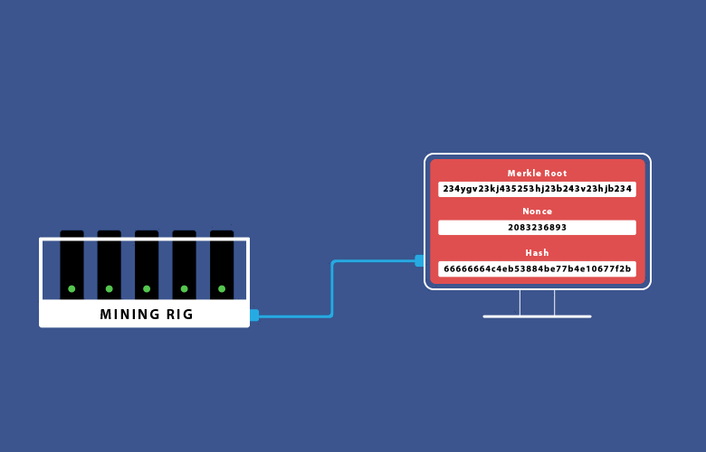

Introduction to Blockchains
===========================

All Aboard the Hype Chain

http://slides.lucywyman.me/introduction-to-blockchain.html

Roadmap
-------

* What blockchains are?
* How blockchains work?
* When should you use blockchains?
* Who's using blockchains now?

:code:`$ whoami`
----------------

.. rst-class:: build

  .. figure:: static/family-picture.jpg
      :align: center
      :height: 300px
    
Lucy Wyman | `@lucyCwyman`

Software Engineer - `Bolt`_

`Puppet`_

.. _Bolt: https://github.com/puppetlabs/bolt
.. _Puppet: https://puppet.com
.. _@lucyCwyman: https://twitter.com/lucycwyman

What *is* a Blockchain?
=======================

A Hash Function
---------------

.. rst-class:: build

* Takes any input, of any size
* Outputs a fixed-sized string
* Output is 'unique' to input
* Idempotent
* Infeasible to invert
* `Learn more <https://en.wikipedia.org/wiki/Cryptographic_hash_function>`_

.. nextslide::

.. code::

    2.4.4 :001 > require 'digest'
    => true
    2.4.4 :002 > Digest::SHA256.hexdigest("Hello SCaLE!")
    => "0bb4b1b2992676414a822941f3160c7669404acb8bb8da18278e4f6aabf83b92" 
    2.4.4 :003 > Digest::SHA256.hexdigest("Longer input, same length output")
    => "380e12f12589eda081e21c794e6379053c75a54c3394ddad0d84026c1a6947ab"

Public Key Encryption
---------------------

.. rst-class:: build

* 2 keys: public key, private key
* Anyone can encrypt a message with my public key, and know that only
  I can decrypt it with my private key
* I can sign a message with my private key, and anyone can decrypt
  with my public key and know it's from me
* High degree of trust
* `Learn more <https://en.wikipedia.org/wiki/Public-key_cryptography>`_

A Block
-------

.. rst-class:: build

  * A `cryptographic hash`_ of the previous block
  * Creation date timestamp
  * Data

   * Each block stores owner's public-key (think `RSA`_)

.. _cryptographic hash: https://en.wikipedia.org/wiki/Cryptographic_hash
.. _RSA: https://en.wikipedia.org/wiki/RSA_(cryptosystem)

For Example
-----------

From https://github.com/lucywyman/blockchain-example

.. code:: ruby

  class Block
    def initialize(index, previous_hash, timestamp, data)
      @index = index
      @previous_hash = previous_hash
      @timestamp = timestamp
      @data = data
      @hash = self.hash_block
    end
  end

Other examples
--------------

* `Javascript`_
* `Python`_
* `Java`_
* `C++`_

.. _Javascript: https://github.com/lhartikk/naivechain/blob/master/main.js
.. _Python: https://medium.com/crypto-currently/lets-build-the-tiniest-blockchain-e70965a248b
.. _Java: https://medium.com/programmers-blockchain/create-simple-blockchain-java-tutorial-from-scratch-6eeed3cb03fa
.. _C++: https://github.com/tko22/simple-blockchain

Another Link in the Chain
-------------------------

.. rst-class:: build

  * A data structure
  * A glorified linked list with only the 'append' function
  * Decentralized | Distributed | "Public"
  * "A distributed digital ledger"

  .. figure:: static/chain.gif
      :height: 300px
      :align: center

      `Gif source <https://media.giphy.com/media/yvzK4m2EoIKs9K0GoF/giphy.gif>`_

.. nextslide::

.. figure:: static/blockchain.png
    :align: center

    `Chain Source <https://medium.com/@lhartikk/a-blockchain-in-200-lines-of-code-963cc1cc0e54>`_

For Example
-----------

.. code:: ruby

  class Blockchain < Array
  attr_reader :chain

  def initialize
    @chain = [self.first_block]
  end 

  def first_block
    return Block.new(0, "0", Time.now, "Hello blockchain!")
  end 

  def add_block(name)
    index = @chain[-1].index + 1 
    previous_hash = @chain[-1].hash
    timestamp = Time.now
    data = "#{name} voted for Hermione Granger"
    block = Block.new(index, previous_hash, timestamp, data)
    @chain.push(block)
  end

How do Blockchains Work?
========================

Adding a Block
--------------

.. rst-class:: build

* Submit a transaction
* Generate the block for that transaction
* Network determines if the block is part of the authoritative chain

Consensus
---------

.. rst-class:: build

  * Because chains are distributed 2 users can have different
    "correct" copies of data
  * Reconciled by having a higher value chain
  * `Consensus algorithm`_
  * Blockchains must be `Byzantine Fault Tolerant`_
  * Typically based on higher `proof of work`_, or
    `proof of stake`_

.. nextslide::

* Any given block will initially have a 'high' probability of not being included.
  That probability will decrease exponentially.

.. _Consensus algorithm: https://medium.com/loom-network/understanding-blockchain-fundamentals-part-2-proof-of-work-proof-of-stake-b6ae907c7edb
.. _proof of work: https://en.wikipedia.org/wiki/Proof-of-work_system
.. _proof of stake: https://en.wikipedia.org/wiki/Proof-of-stake
.. _Byzantine Fault Tolerant: https://medium.com/loom-network/understanding-blockchain-fundamentals-part-1-byzantine-fault-tolerance-245f46fe8419

Proof of Work
-------------

.. rst-class:: build

* Start with a `nonce`_ (32-bit number)
* Hash the block
* See if it's under the `current target`_ (256-bit number)
* If not, increment nonce and try again

    `Proof source <https://bitsapphire.com/makes-blockchain-protocols-future/>`_

.. _nonce: https://en.bitcoin.it/wiki/Nonce
.. _current target: https://en.bitcoin.it/wiki/Target

Security
--------

.. rst-class:: build

* Because each block contains a hash of the previous block a bad actor
  would need to change a block then rehash, in order, every block in
  the chain
* Can say with certainty that blocks older than X were made by that
  user at that time with that data
* Doesn't ensure data is valid

Decentralization
----------------

.. rst-class:: build 

* No single point of failure
* No central authority that needs to be trusted - consensus algorithm
  decides which is the authoritative chain
* Publicly verifiable | Security through publicity

Public?
-------

"An issue in this ongoing debate is whether a private system with
verifiers tasked and authorized (permissioned) by a central authority
should be considered a blockchain.[51][52][53][54][55]" `Wikipedia
<https://en.wikipedia.org/wiki/Blockchain>`_

.. rst-class:: build

  * Proponents argue blockchains are structures
  * Opponents argue private chains don't support decentralized data
    verification, not protected from operator tampering
  * Words are hard.
  * A handy `visualization`_

.. _visualization: https://assets.sourcemedia.com/dims4/default/caca1a7/2147483647/resize/680x%3E/quality/90/?url=https%3A%2F%2Fassets.sourcemedia.com%2F99%2Fcd%2F7d03260a4e82a2383e406e9f7a6e%2Fab041116blockchain.jpg

When Should I Use Blockchains?
==============================

`Blockchain Beyond the Hype`_
=============================

.. _Blockchain Beyond the Hype: http://www3.weforum.org/docs/48423_Whether_Blockchain_WP.pdf

Characteristics
---------------

.. rst-class:: build

* Accurate | secure | immutable
* Increasing data set
* Digital Assets
* Work directly with consumers | Remove intermediaries
* Primarily transactional data
* Contributors don't trust each other

Potentials
----------

* Facilitating digital transactions

  * `Digital currency`_
  * `Crowdfunding`_
  * `Prediction Markets`_

* Voting

  * Registration
  * Ballot counting

.. _Digital currency: https://en.wikipedia.org/wiki/Digital_currency
.. _Crowdfunding: https://en.wikipedia.org/wiki/Crowdfunding
.. _Prediction Markets: https://en.wikipedia.org/wiki/Prediction_market

When Shouldn't I Use Blockchains?
---------------------------------

"Blockchain was built to solve a social problem, not a technical
problem"

* Because it's the ~new shiny~
* When you don't want transactions stored forever
* When your current technology works

The Blockies
============

Most Charitable
---------------

.. rst-class:: build

  `World Food Programme Building Blocks`_

  .. figure:: static/wfp-building-blocks.jpg
      :align: center
      :height: 200px

      `WFP Source <https://innovation.wfp.org/project/building-blocks>`_

Most Democratic
---------------

.. rst-class:: build

    `Follow My Vote`_

    .. figure:: static/follow-my-vote.png
        :align: center

        `FMV Source <https://followmyvote.com/>`_

Most Up-and-Coming
------------------

.. rst-class:: build

   `Supply Chain Tracking`_

   .. figure:: static/supply-chain.jpg
        :align: center
        :height: 300px

        `Supply source <https://kryptomoney.com/port-brisbane-adopts-australias-first-blockchain-supply-chain-system/>`_

   * Expensive goods (i.e. Diamonds)
   * Food contamination tracing

.. _Supply Chain Tracking: https://www.ibm.com/blockchain/industries/supply-chain 

Cutest
------

.. rst-class:: build

  `CryptoKitties`_

  .. figure:: static/cryptokitties.png
      :align: center
      :height: 350px
      
      `Kitties Source <https://www.cryptokitties.co/>`_

  .. _CryptoKitties: https://www.cryptokitties.co/

Honorable Mentions
------------------

* Land registration in `Sweden`_, `Republic of Georgia`_
* Entirely digitized `financial services`_

  * Level One project, Bill Melinda Gates Foundation

* `Identity management`_
* `Smart Contracts`_ - Not actual blockchains, intro'd by Ethereum in 2015
* `Pay-per-use`_ media
* Make `copyright registration`_ more user friendly
* Managing `medical records`_
* `Storing files`_
* `And more!`_

.. _Sweden: https://www.reuters.com/article/us-sweden-blockchain-idUSKCN0Z22KV
.. _Republic of Georgia: https://www.forbes.com/sites/laurashin/2016/04/21/republic-of-georgia-to-pilot-land-titling-on-blockchain-with-economist-hernando-de-soto-bitfury/#2c22fce144da
.. _financial services: https://www.technologyreview.com/s/604144/how-blockchain-can-lift-up-the-worlds-poor/
.. _World Food Programme Building Blocks: https://insight.wfp.org/what-is-blockchain-and-how-is-it-connected-to-fighting-hunger-7f1b42da9fe
.. _medical records: https://viral.media.mit.edu/pub/medrec
.. _Smart Contracts: https://en.wikipedia.org/wiki/Smart_contract
.. _Pay-per-use: https://www.alexandria.io/#make-more-money
.. _Copyright Registration: https://news.bitcoin.com/future-use-cases-for-blockchain-technology-copyright-registration/
.. _Follow My Vote: https://followmyvote.com/online-voting-platform-faqs/
.. _Storing files: https://storj.io/
.. _Identity management: https://bitcoinmagazine.com/articles/microsoft-building-open-blockchain-based-identity-system-with-blockstack-consensys-1464968713/
.. _And more!: https://www.forbes.com/sites/bernardmarr/2018/01/22/35-amazing-real-world-examples-of-how-blockchain-is-changing-our-world/#24b53ebf43b5

Why Aren't Blockchains Widely Adopted Yet?
------------------------------------------

.. rst-class:: build

* Too early
* A solution looking for a problem
* Migrating existing infrastructure is expensive, and may not be worth
  the costs
* Doesn't necessarily offer sufficient improvement over existing
  technology

Resources
---------

* `Wikipedia page`_
* `Understanding the Blockchain`_ (O'Reilly)
* `Guide to Blockchain`_ (Wired)
* `The Great Chain`_ (The Economist)
* `Unchained Podcast`_
* `Proof of Stake Explained`_

.. _Wikipedia page: https://en.wikipedia.org/wiki/Blockchain
.. _Understanding the Blockchain: https://www.oreilly.com/ideas/understanding-the-blockchain
.. _Guide to Blockchain: https://www.wired.com/story/guide-blockchain/
.. _Unchained Podcast: http://unchainedpodcast.co/
.. _Naivechain: https://github.com/lhartikk/naivechain
.. _Proof of Stake Explained: https://github.com/ethereum/wiki/wiki/Proof-of-Stake-FAQs
.. _The Great Chain: https://www.economist.com/briefing/2015/10/31/the-great-chain-of-being-sure-about-things

Questions
---------

.. figure:: static/kelly-kapoor-questions.gif
    :align: center
    :height: 400px

Thank you!
==========
