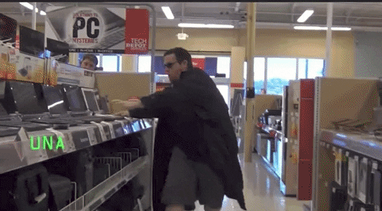

Linux Jargon
============

http://slides.lucywyman.me/linux-jargon.html

.. note::
	Let us take a tour through space and time to visit
	the milestones of Technology as we know it now.
	This talk will be your guide, cultural and technical.
	Rest easy, gentle n00b, and come along for the ride.

:code:`$ whoami`
----------------

.. rst-class:: build

    .. figure:: static/programmer-valentine.gif
        :align: center
        :height: 300px

Lucy Wyman

Software Engineer - `Bolt`_

`Puppet`_

`Source <https://www.reddit.com/r/gifs/comments/5tyymj/programmer_valentain_day/>`_

.. _Puppet: https://puppet.com
.. _Bolt: https://github.com/puppetlabs/bolt

Hacker
------

"A human who engages in activities (such as programming or other
media) in a spirit of playfulness and exploration" ~ `Wikipedia`_

Conversational Acronyms
-----------------------

.. rst-class:: build

* **AFAIK** - as far as I know
* **AFK** - away from keyboard
* **BDFL** - `Benevolent Dictator for Life`_
* **BOFH** - `Bastard Operator from Hell`_
* **IIRC** - if I recall correctly
* **IMHO** - in my humble opinion
* **IRC** - internet relay chat
* **TLA** - three letter acronym
* **YMMV** - your mileage may vary

.. _Bastard Operator from Hell: http://bofh.bjash.com/

Technical Acronyms
------------------

.. rst-class:: build

* **API** - Application Programming Interface
* **BSD** - Berkley Software Distribution
* **CLI** - Command Line Interface
* **[D]DOS** - [Distributed] Denial of Service
* **DHCP** - Dynamic Host Control Protocol
* **DNS** - Domain Name System
* **EMACS** - Editing MACroS - inferior text editor
* **EO[f | l | d | m]** - End of [file | line | day | message]

.. nextslide::

.. rst-class:: build

* **FIFO** - First In First Out
* **FIXME/TODO** - (Highlighted) note to fix something
* **GCC** - Gnu Compiler Collection
* **GNU** - Gnu's Not Unix
* **GUI** - Graphical User Interface
* **INTERCAL** - Compiler Language With No Pronounceable Acronym
* **ISP** - Internet Service Provider
* **[K | M ]IPS** - [Kilo | Mega]Instructions Per Second

.. nextslide::

.. rst-class:: build

* **MOTD** - Message of the Day
* `RTFM`_ - Read the cussing manual
* **TTY** - Teletype terminal
* **Vim** - Vi iMproved, superior text editor
* **WYSIWYG** - What you see is what you get
* **yaourt** - Yet AnOther User Repository Tool. CLI for pacman,
  arch linux package manager

Security Acronyms
-----------------

.. rst-class:: build

* **PGP** - `Pretty Good Privacy`_. Data encryption program + standard
* **GPG** - `Gnu Privacy Guard`_. Open source implementation of PGP
* **RSA** - 3 really smart dudes names. `Public key cryptosystem`_
* **SHA** - `Secure Hash Algorithm`_. For hashing things. Like browns. Hash browns.
* **DH** - `Diffie-Hellman`_. Secure key exchange

.. _Pretty Good Privacy: https://en.wikipedia.org/wiki/Pretty_Good_Privacy
.. _Gnu Privacy Guard: https://en.wikipedia.org/wiki/GNU_Privacy_Guard
.. _Public key cryptosystem: https://en.wikipedia.org/wiki/RSA_(cryptosystem)
.. _Secure Hash Algorithm: https://en.wikipedia.org/wiki/Secure_Hash_Algorithm
.. _Diffie-Hellman: https://en.wikipedia.org/wiki/Diffie%E2%80%93Hellman_key_exchange

Utilities: Must haves
---------------------

.. rst-class:: build

* man
* ls
* cd
* less
* cat
* grep
* find
* cowsay

Utilities: You probably already know
------------------------------------

.. rst-class:: build

* alsamixer
* tree
* htop
* curl/wget
* wc
* cal
* tmux
* xargs
* rsync/scp

Utilities: Out there
--------------------

.. rst-class:: build

* rtorrent
* gparted
* mdadm
* lshw
* indent
* apropos

Directories
-----------

.. rst-class:: build

* **/bin** - User binaries (things you run)
* **/dev** - Device files (terminal, usb, ram, etc.)
* **/etc** - Configurations for installed programs
* **/home** - Where your personal files are stored
* **/lib** - Library files to support installed binaries
* **/opt** - Additional applications
* **/proc** - Information about system processes
* **/root** - Root user's home directory
* **/sbin** - System binaries (things your system runs)
* **/tmp** - Temporary files
* **/usr** - Binaries, libraries, docs, and source code for programs
  you install
* **/var** - Files that are expected to grow (logs, backups, cache,
  etc.)

Technical Words
---------------

.. rst-class:: build

* **Backdoor** - A hole or "way in" to a secure system deliberately
  placed, usually by developers
* **[Big | Little]-endian** - Whether the most significant bit is at
  the lowest (Big-endian) or highest (little-endian) address.
* **Daemon** - A process that runs in the background
* **Fork bomb** - A program which creates two versions of itself upon
  startup, growing exponentially until you run out of memory
* **Partition** - "The creation of one or more regions on a hard disk
  or other secondary storage, so that an operating system can manage
  information in each region separately."

.. nextslide::

.. rst-class:: build

* **POSIX** - A family of API standards which maintain compatibility
  between operating systems
* **Quine** - A program which outputs itself (and only itself)
* **Raid configuration** - combines multiple physical disk drives into
  a single logical unit
* **Rot13** - Cipher which rotates the alphabet 13 places
* **Sudo** - Superuser do
* **Unix** - A family of computer operating systems derived from AT&T
  Unix
* **X11** - A windowing system for bitmap displays, common on Unix
  systems

Work Culture Words
------------------

.. rst-class:: build

* **Astroturfing** - "The use of paid shills to create the impression
  of a popular movement"
* **Bikeshedding** - "Technical disputes over minor, marginal issues
  conducted while more serious ones are being overlooked"
* **Capture the Flag (CTF)** - A contest in which participants try to
  hack into a system to retrieve a "flag" (on purpose)
* **Code monkey** - Passionless code producer
* **Copyleft - GPL** - The GNU General Public License

.. nextslide::

.. rst-class:: build

* **Dogfooding** - Using software internally for testing
* **Foo/bar/baz** - Placeholder words
* **Grok** - To understand something all the way through, or very well
* **Halt and Catch Fire** - Machine code instruction that causes
  meaningful operation to stop 

.. nextslide::

.. rst-class:: build

* **Heisenbug** - A bug that only appears sometimes, intended to drive 
  developers insane
* **Idempotent** - An element that acts the same if used once as when used
  multiple times
* **Lorem ipsum** - Paragraph text used as a placeholder
* **Nibble** - 4 bits
* **Script kiddie** 
* **Syntactic sugar** - Features added to a language to make it more human
  readable
* `XKCD mouse`_ 
* **Zero day** - An undisclosed vulnerability that can be exploited

Books
-----

.. rst-class:: build

* `Hackers clip`_
* **The Dragon Book** - Compilers: Principles, Techniques, and Tools
  by Alfred V. Aho, Monica S. Lam, Ravi Sethi, Jeffrey D. Ullman.
* **Pink Shirt Book** - Programmers Guide to the IBM PC by "The Peter Norton"
* **GEB** - Godel, Escher, Bach by Douglas Hofstadter
* **The Devil Book (aka Unix Bible)** -  The Design and Implementation
  of the 4.3BSD Unix Operating System by Samuel J. Leffler, Marshall Kirk
  McKusick, Michael J. Karels and John S. Quarterman.
* **Ugly Red Book** -  Trusted Network Interpretation of the Trusted
  Computer System Evaluation Criteria

Punctuation
-----------

.. rst-class:: build

* Bang - !
* Hat - ^
* Splat or star - *
* Hash or octothorp - #

Stuff to know
-------------

.. rst-class:: build

* `All your base are belong to us`_ - A poor Japanese to English translation in the opening scenes of Zero Wing
* `The magic switch`_ 
* `hunter2`_
* `Hackers (1995)`_ - "Should have been titled Crackers, because cracking is
  what the movie was about. It's understandable that they didn't however;
  titles redolent of snack food are probably a tough sell in Hollywood."
* `This StackOverflow post`_ 
* The Evil Bit (`RFC 3514`_)

.. nextslide::

.. rst-class:: build

* `Obfuscated C Contest`_
* `RFC 1149`_
* Konami code
* And of course, `XKCD`_

Resources
---------

* `The Jargon File`_ (`This page`_)
* `Linux Dictionary`_

.. _Wikipedia: https://en.wikipedia.org/wiki/Hacker_culture
.. _Benevolent Dictator for Life: https://en.wikipedia.org/wiki/Benevolent_dictator_for_life
.. _RTFM: http://rlv.zcache.com/mao_rtfm_front_t_shirts-ra90bd4e0d5984c1c9b741c4812232282_jgogh_1024.jpg?rlvnet=1
.. _XKCD mouse: https://xkcd.com/243/
.. _Knights of the Lambda Calculus: https://en.wikipedia.org/wiki/Knights_of_the_Lambda_Calculus
.. _Hackers clip: https://www.youtube.com/watch?v=4U9MI0u2VIE
.. _RFC 3514: https://tools.ietf.org/html/rfc3514
.. _All your base are belong to us: http://catb.org/jargon/html/A/all-your-base-are-belong-to-us.html
.. _The magic switch: http://catb.org/jargon/html/magic-story.html
.. _Hackers (1995): 
.. _This StackOverflow post: http://stackoverflow.com/questions/1732348/regex-match-open-tags-except-xhtml-self-contained-tags
.. _Obfuscated C Contest: http://www.ioccc.org/
.. _hunter2: http://bash.org/?244321
.. _RFC 1149: https://tools.ietf.org/html/rfc1149
.. _The Evolution of the Haskell Programmer: http://www.willamette.edu/~fruehr/haskell/evolution.html
.. _The Jargon File: http://catb.org/jargon/html/index.html
.. _This page: http://catb.org/jargon/html/S/SEX.html
.. _Linux Dictionary: http://www.tldp.org/LDP/Linux-Dictionary/html/
.. _XKCD: https://xkcd.com
