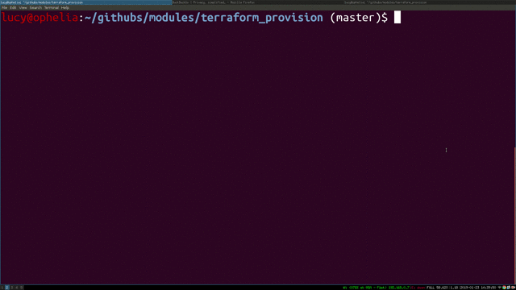

Cloud Provisioning with Terraform and Bolt
==========================================

http://slides.lucywyman.me/terraform-and-bolt.html

Terraform + Bolt = ?
--------------------

We aren't sure yet what we want the relationship between Bolt and
Terraform to be.

From our users
--------------

.. raw:: html

    <blockquote class="twitter-tweet" data-conversation="none"
    data-lang="en">
I’m currently using <a
    href="https://twitter.com/hashtag/puppetbolt?src=hash&amp;ref_src=twsrc%5Etfw">#puppetbolt</a>
    to help fully automate <a
    href="https://twitter.com/hashtag/azure?src=hash&amp;ref_src=twsrc%5Etfw">#azure</a>
    vm builds in conjunction with <a
    href="https://twitter.com/hashtag/terraform?src=hash&amp;ref_src=twsrc%5Etfw">#terraform</a>.
    Terraform stands up the infrastructure and bolt helps me get <a
    href="https://twitter.com/hashtag/puppetserver?src=hash&amp;ref_src=twsrc%5Etfw">#puppetserver</a>
    and <a
    href="https://twitter.com/hashtag/puppetagents?src=hash&amp;ref_src=twsrc%5Etfw">#puppetagents</a>
    running to finish things up.
&mdash; Justin Knash (@JustinKnash) <a
    href="https://twitter.com/JustinKnash/status/1089891738704060417?ref_src=twsrc%5Etfw">January
    28, 2019</a></blockquote>
    

    <blockquote class="twitter-tweet" data-conversation="none"
    data-lang="en">
We&#39;re using <a
    href="https://twitter.com/hashtag/puppetbolt?src=hash&amp;ref_src=twsrc%5Etfw">#puppetbolt</a>
    to automate deployment of applications to servers that are being
    provisioned via a combination of Terraform and Puppet Opensource.
    Makes for VERY quick upgrades and deployments! Inventory files
    make life so easy.
&mdash; Daemon Gibson (@DaemonGibson) <a
    href="https://twitter.com/DaemonGibson/status/1090358039155273734?ref_src=twsrc%5Etfw">January
    29, 2019</a></blockquote>
    

Resources
---------

* https://github.com/lucywyman/terraform-provision
* http://blog.lucywyman.me/cloud-provisioning-with-terraform-and-bolt.html

Demo
----

