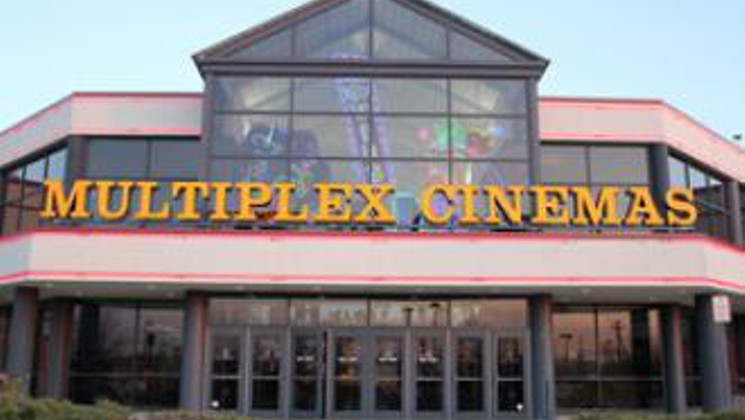

Tmux + Screen
=============

Multiplexing and You

First, History
--------------

.. figure:: static/televideo_terminal.jpg
    :align: center
    :width: 400px

The Problems
------------

* Limited to one window (multiple connections for multiple windows)
* Foreground processes stop when ssh connection terminates
* Only one machine can "partake" in a session

The Solution
------------

Tmux and Screen
---------------

* Both are widely used, well documented, and actively maintained
* Both allow you to open multiple "windows" in a single ssh session, and multiple tiled "panes" within those windows
* Both allow you to detach and reattach sessions
* Both allow more than one user to connect to a particular session at a time
* Both are generally not installed by default but available in most distribution repositories

Screen
------

Keeping it simple since 1987.

* Logging output if screen is detached 
* Can't split windows into panes vertically
* Can't maintain screen split through detach
* Better line wrapping
* Can connect to serial devices

Tmux
----

The Shiny New.

* Better tiling + window management
* Unicode support
* Easy status bar configuration
* Scriptable with :code:`tmux command [args]`
* Pre-installed on BSD distros

Demo Time!
----------

.. figure:: static/demo-day.gif
    :align: center
    :width: 800px

