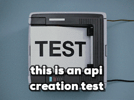

What Not To Automate
====================

https://slides.lucywyman.me/what-not-to-automate-short.html

Automate everything*
====================

Agenda
------

* Automation: what and why
* To automate, or not to automate
* Automation gone wrong

Automation
----------

"Automation is the technology by which a process or procedure is
performed **without human assistance.**" - `Wikipedia`_

    http://gph.is/2gDV0zj

.. _Wikipedia: https://en.wikipedia.org/wiki/Automation

Why Do We Automate?
-------------------

* To save time & money

  * Maintenance & education
* For consistency | stability | fewer mistakes
* Visibility
* Because we don't enjoy a task

.. figure:: static/bb8-yes.gif
    :align: center
    :height: 200px

    http://gph.is/1peMWbm

Should I Automate This?
=======================

Practical Considerations
------------------------
 
* See slide #6
* https://xkcd.com/1205/

.. figure:: static/xkcd-automation.png
    :align: center
    :height: 400px

    https://xkcd.com/1319/

Ethical Considerations
----------------------

* What are the impacts?
* Are parameters limited and well understood?
* Codifying unconscious bias
* **Are profits and costs fairly distributed?**

What Not to Automate
--------------------

* Low-volume tasks
  
  * Instead write great docs on how to do it!

* Tasks that require human context
* Complex tasks
* High-risk tasks

  * Instead, have human 'check points' to verify high-risk tasks

Automation Gone Wrong
=====================

Suggestions
-----------

.. raw:: html

  <blockquote class="twitter-tweet" data-lang="en">
Dear Amazon, I bought a toilet seat because I needed one.
  Necessity, not desire. I do not collect them. I am not a toilet seat
  addict. No matter how temptingly you email me, I&#39;m not going to
  think, oh go on then, just one more toilet seat, I&#39;ll treat
  myself.
&mdash; Jac Rayner (@GirlFromBlupo) <a
  href="https://twitter.com/GirlFromBlupo/status/982156453396996096?ref_src=twsrc%5Etfw">April
  6, 2018</a></blockquote>
  

Context

`Stock Exchange Automation`_
============================

.. _Stock Exchange Automation: https://www.bbc.com/news/magazine-19214294

Failure at scale

`Hiring AI`_
============

.. _Hiring AI: https://www.reuters.com/article/us-amazon-com-jobs-automation-insight/amazon-scraps-secret-ai-recruiting-tool-that-showed-bias-against-women-idUSKCN1MK08G

Complex and high risk

`Facial Recognition Software`_
==============================

.. _Facial Recognition Software: https://www.theguardian.com/technology/2017/dec/04/racist-facial-recognition-white-coders-black-people-police

Faulty and high risk

`Automate software, not too much, mostly maths`_
================================================

.. _Automate software, not too much, mostly maths: https://michaelpollan.com/reviews/how-to-eat/

Resources
---------

* `6 Signs It's Time to Automate <https://www.microfocus.com/media/white-paper/six_signs_its_time_to_automate_that_process_wp.pdf>`_
* `This TED Talk <https://www.youtube.com/watch?v=th3nnEpITz0>`_
* `When the Going Gets Tough <https://www.denave.com/when-the-going-gets-tough-automation-gone-wrong/>`_

Thank You!
==========
