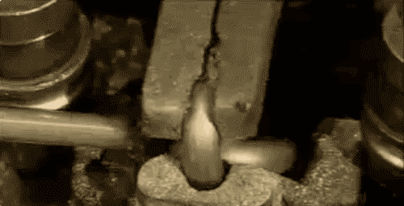

What Not To Automate
====================

https://slides.lucywyman.me/what-not-to-automate.html

.. |ss| raw:: html

   <strike>

.. |se| raw:: html

   </strike>

|ss| Automation is bad |se|
===========================

Automate everything*
====================

Agenda
------

* What automation is, and why we automate
* What to consider when automating
* Automation gone wrong

:code:`$ whoami`
----------------

.. raw:: html

    <blockquote class="twitter-tweet" data-lang="en">
Grandma: I hear they&#39;re turning shipping containers into
    affordable housing!  Me to Eli: Even at Christmas, it&#39;s just
    docker docker docker
&mdash; Lucy Wyman (@lucycwyman) <a
    href="https://twitter.com/lucycwyman/status/1078850614384197632?ref_src=twsrc%5Etfw">December
    29, 2018</a></blockquote>
    

Lucy Wyman

Software Engineer | `Bolt Influencer`_ at `Puppet`_

.. _Bolt Influencer: https://github.com/puppetlabs/bolt
.. _Puppet: https://puppet.com

What Is Automation?
-------------------

    `Heidi Waterhouse`_

.. _Heidi Waterhouse: https://docs.google.com/presentation/d/1BtN8H8MI6LzkJQHqhFH4d1OWO4jallCTublqKJiZxN0/edit#slide=id.g2ed31b77db_0_173

.. nextslide::

"Automation is the technology by which a process or procedure is
performed **without human assistance.**" - `Wikipedia`_

Focus on software automation

.. figure:: static/api-test.gif
    :align: center
    :height: 300px

    http://gph.is/2gDV0zj

.. _Wikipedia: https://en.wikipedia.org/wiki/Automation

Why Do We Automate?
===================

To Save Human Time
------------------

For Consistency | Stability | Fewer Mistakes
--------------------------------------------

Visibility
----------

.. figure:: static/marshmallow-cutter.gif
    :align: center
    :height: 400px

Because We Don't Enjoy a Task
-----------------------------

.. figure:: static/pretzel-maker.gif
    :align: center
    :height: 400px

To Save Money
-------------

    http://gph.is/112JVhL

To be clear, automation is pretty great
---------------------------------------

.. figure:: static/bb8-yes.gif
    :align: center
    :height: 400px

    http://gph.is/1peMWbm

What To Consider When Automating
================================

Is It Worth It?
---------------

.. figure:: static/xkcd-automation.png
    :align: center
    :height: 500px

    https://xkcd.com/1319/

.. nextslide::

.. figure:: static/is_it_worth_the_time.png
    :align: center
    :height: 500px

    https://xkcd.com/1205/

Costs & Savings
---------------

.. rst-class:: build

==============  ============== 
Costs           Savings
==============  ==============
Time & Money    Time & Money
Maintenance     Maintenance
Sanity          Sanity
Security        Security
Flexibility     Flexibility
Education       Education
==============  ==============

Ethical Considerations
----------------------

.. rst-class:: build

* Who profits from this automation?
* Codifying your unconscious bias
* What are the impacts? Who might this impact?
* Do you understand what you do to make this decision?
* Are the parameters limited and well understood?

Job Loss
--------

.. rst-class:: build

  * Previous industrial and automation revolutions have shown that
    people just get other, usually better jobs

    * `Automated Teller Machines`_

  .. figure:: static/bank-tellers.jpg
      :align: center
      :height: 400px

      https://www.aei.org/publication/what-atms-bank-tellers-rise-robots-and-jobs/

.. _Automated Teller Machines: https://youtu.be/th3nnEpITz0?t=160

Are profits of automation evenly distributed?
=============================================

When Not To Automate
--------------------

.. rst-class:: build

* Low-volume tasks
  
  * Instead write great docs on how to do it!

* Tasks that require human context - many decision points
* UX testing
* Complex tasks
* High-risk tasks

  * Instead, have human 'check points' to verify high-risk tasks

Automation Can
--------------

* Make you lose sight of your goal
* Be difficult to adopt
* Cause failure at scale

Automation Gone Wrong
=====================

Suggestions
-----------

.. raw:: html

  <blockquote class="twitter-tweet" data-lang="en">
Dear Amazon, I bought a toilet seat because I needed one.
  Necessity, not desire. I do not collect them. I am not a toilet seat
  addict. No matter how temptingly you email me, I&#39;m not going to
  think, oh go on then, just one more toilet seat, I&#39;ll treat
  myself.
&mdash; Jac Rayner (@GirlFromBlupo) <a
  href="https://twitter.com/GirlFromBlupo/status/982156453396996096?ref_src=twsrc%5Etfw">April
  6, 2018</a></blockquote>
  

.. nextslide::

.. figure:: static/amazon-baseball-bat.jpg
    :align: center
    :height: 500px

`Breastfeeding Photos Flagged as Nudity`_
=========================================

.. _Breastfeeding Photos Flagged as Nudity: https://bits.blogs.nytimes.com/2009/01/02/breastfeeding-facebook-photos/

`Stock Exchange Automation`_
============================

.. _Stock Exchange Automation: https://www.bbc.com/news/magazine-19214294

`Hiring AI`_
============

.. _Hiring AI: https://www.reuters.com/article/us-amazon-com-jobs-automation-insight/amazon-scraps-secret-ai-recruiting-tool-that-showed-bias-against-women-idUSKCN1MK08G

`Facial Recognition Software`_
==============================

.. _Facial Recognition Software: https://www.theguardian.com/technology/2017/dec/04/racist-facial-recognition-white-coders-black-people-police

The Takeaway: Don't be afraid of automation, automate with respect
==================================================================

`Automate software, not too much, mostly maths`_
================================================

.. _Automate software, not too much, mostly maths: https://michaelpollan.com/reviews/how-to-eat/

Resources
---------

* `6 Signs It's Time to Automate <https://www.microfocus.com/media/white-paper/six_signs_its_time_to_automate_that_process_wp.pdf>`_
* `This TED Talk <https://www.youtube.com/watch?v=th3nnEpITz0>`_
* `When the Going Gets Tough <https://www.denave.com/when-the-going-gets-tough-automation-gone-wrong/>`_

Questions?
----------

.. rst-class:: build

.. figure:: static/rdj-question.gif
    :align: center
    :height: 400px

Thank You!
==========
